# VM-Terraform

## Descripción
Este repositorio contiene archivos de terraform capaces de crear una maquina virtual Linux de Ubuntu.Terraform es una herramienta de código abierto de HashiCorp que permite definir y aprovisionar infraestructura como código.

## Pre-Requisitos
Antes de comenzar, asegurate de tener terraform instalado
<div style="text-align: left">
    <p>
        <a href="https://www.terraform.io/downloads.html" target="_blank"> </a>
    </p>
</div>

Asegurate de tener:

- [Terraform](https://www.terraform.io/downloads.html) instalado en tu maquina local.
- Azure CLI instaldo y configurado con las credenciales

## Versionamiento

Este proyecto esta siendo versionado mediante Git y Github

<div style="text-align: left">
    <a href="https://git-scm.com/" target="_blank"> </a>
    <a href="https://github.com/" target="_blank"> </a>
</div>

## ¿Como empezar?

### Paso 1
Debemos de crear una carpeta que contenga los siguientes archivos
- main.tf (Contendra nuestro codigo fuente para crear las instancias en Azure)
- variables.tf (Definiremos las variables que vamos a utilizar)
- terraform.tfvars (Le damos los valores a las variables creadas en el archivo variables.tf)
- outputs.tf (Al crear una instancia definimos la salidad que deseamos ver)

### Paso 2 
Ahora bien, vamos a definir las variables utilizadas en este projecto, esto se hará en el documento variables.tf
```terraform
variable name_function{
    type = string
    description = "Virtual machine name"
}

variable location{
    type = string
    default = "West Europe"
    description = "Location"
}

variable username {
    type = string
    description = "Username"
}
```

### Paso 3
Una vez definidas las variables, le vamos a dar valores a estas, lo hacemos en el archivo terraform.tfvars
```terraform
name_function = "virtualMachineGSB"
location = "East US"
username = "usernamegsb"
```

### Paso 4
Definimos el provider y el grupo de recursos que se va a utilizar en el despliegue de las instancias
```terraform
# Se define el provider que se va a usar, en este caso Azure
provider "azurerm" {
    features{}
}

# Se crea el grupo de recursos donde montaremos nuestros recursos
resource "azurerm_resource_group" "GSBvm"{
    name = var.name_function
    location = var.location
} 
```

### Paso 5
Definimos las instancias de Azure que necesitaremos para crear la Virtual Machine.
- Red Virtual
```terraform
resource "azurerm_virtual_network" "virtualNetworkGSB"{
    name = "virtualNet${var.name_function}"
    location = azurerm_resource_group.GSBvm.location
    resource_group_name = azurerm_resource_group.GSBvm.name
    address_space = ["10.0.0.0/16"]
    dns_servers = ["10.0.0.4", "10.0.0.5"]

    tags = {
        environment = "Production"
    }
}
```
- Subred
```terraform
resource "azurerm_subnet" "subnetGSB" {
    name = "subnet${var.name_function}"
    resource_group_name = azurerm_resource_group.GSBvm.name
    virtual_network_name = azurerm_virtual_network.virtualNetworkGSB.name
    address_prefixes = ["10.0.2.0/24"]
}
```
- IP Publica
```terraform
resource "azurerm_public_ip" "IPpublicGSB" {
    name = "IPpublic${var.name_function}"
    location = azurerm_resource_group.GSBvm.location
    resource_group_name = azurerm_resource_group.GSBvm.name
    allocation_method = "Static"

    tags = {
        environment = "Production"
    }
}
```
- Interfaz de red
```terraform
resource "azurerm_network_interface" "networkInterfaceGSB" {
    name = "networkInteface${var.name_function}"
    location = azurerm_resource_group.GSBvm.location
    resource_group_name = azurerm_resource_group.GSBvm.name

    ip_configuration{
        name = "internal"
        subnet_id = azurerm_subnet.subnetGSB.id
        public_ip_address_id = azurerm_public_ip.IPpublicGSB.id
        private_ip_address_allocation = "Dynamic"
    }
}
```
- Grupo de seguridad
```terraform
resource "azurerm_network_security_group" "groupSecurityGSB"{
    name = "acceptanceTestSecurityGroup1${var.name_function}"
    location = azurerm_resource_group.GSBvm.location
    resource_group_name = azurerm_resource_group.GSBvm.name

    security_rule {
        name = "test123SSH"
        priority = "100"
        direction = "Inbound"
        access = "Allow"
        protocol = "Tcp"
        source_port_range = "*"
        destination_port_range = "22"
        source_address_prefix  = "*"
        destination_address_prefix = "*"
    }

    security_rule{
        name = "PING"
        priority = "1000"
        direction = "Inbound"
        access = "Allow"
        protocol = "Icmp"
        source_port_range = "*"
        destination_port_range = "*"
        source_address_prefix = "*"
        destination_address_prefix = "*"
    }

    tags = {
        environment = "Production"
    }
}
```
- Asociar la interfaz de red con el grupo de seguridad
```terraform
resource "azurerm_network_interface_security_group_association" "IR-GS" {
  network_interface_id = azurerm_network_interface.networkInterfaceGSB.id
  network_security_group_id = azurerm_network_security_group.groupSecurityGSB.id
}
```
- Crear la maquina virtual Linux
```terraform
resource "azurerm_linux_virtual_machine" "vmLinuxGSB" {
    name = "vmLinux${var.name_function}"
    resource_group_name = azurerm_resource_group.GSBvm.name
    location = azurerm_resource_group.GSBvm.location
    size = "Standard_F2"
    admin_username = var.name_function
    network_interface_ids = [azurerm_network_interface.networkInterfaceGSB.id]
    
    admin_ssh_key {
        username = var.name_function
        public_key = file("C:/Users/semillero/id_rsa.pub")
    }

    os_disk {
        caching = "ReadWrite"
        storage_account_type = "Standard_LRS"
    }

    source_image_reference {
        publisher = "Canonical"
        offer = "0001-com-ubuntu-server-focal"
        sku = "20_04-lts"
        version = "latest"
    }
}
```

### Paso 6
Definimos nuestro archivo outputs.tf
```terraform
output "public_ip_address" {
    value = azurerm_public_ip.IPpublicGSB.ip_address
}
```

## Comandos de Terraform
Una vez tenemos el codigo listo, debemos de montar nuestras maquinas a la nube, para lograr esto debemos de utilizar los siguientes comandos
- terraform init (Descargar los providers)
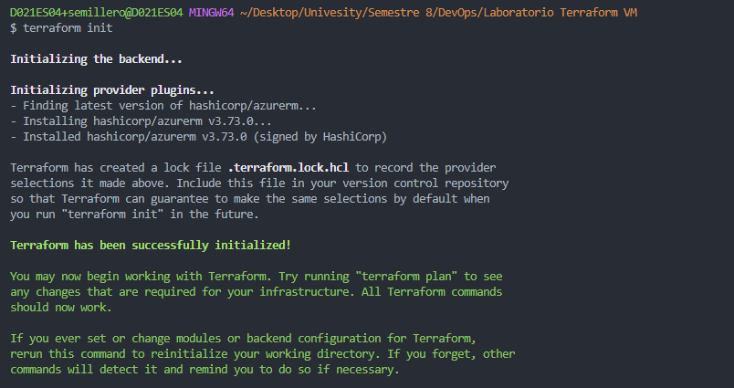
- terraform validate (Valida la sintaxis de nuestro codigo de terraform)
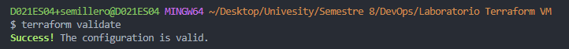
- terraform plan (Muestra los cambios que se aplicaran)
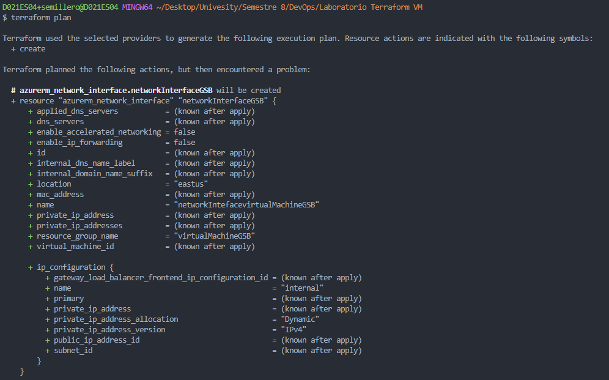
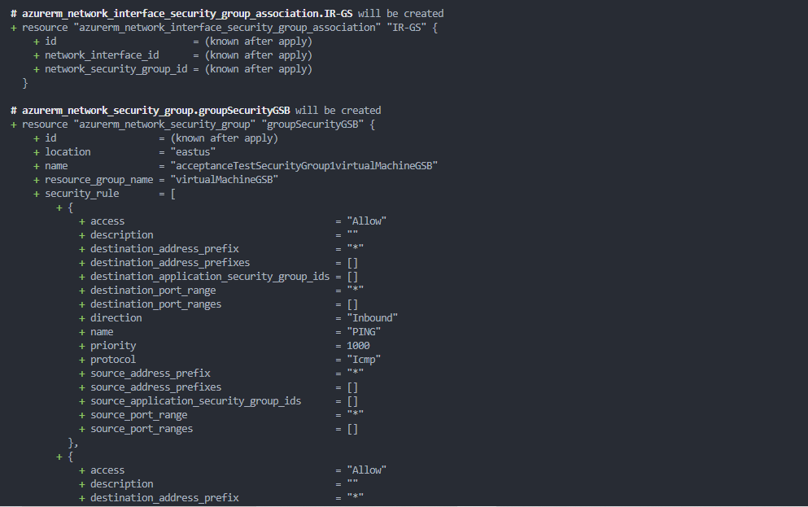
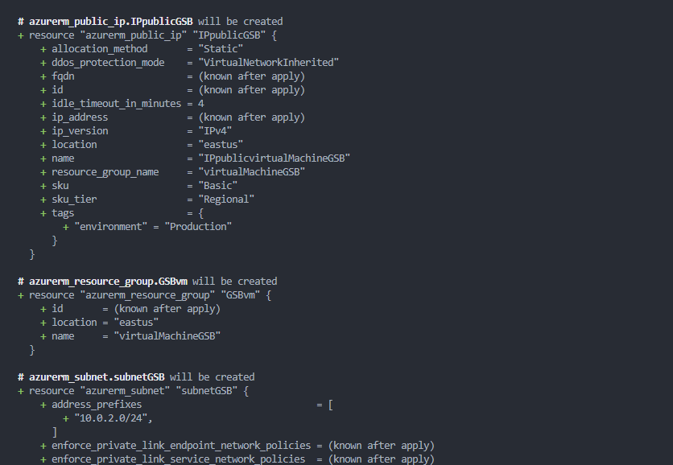
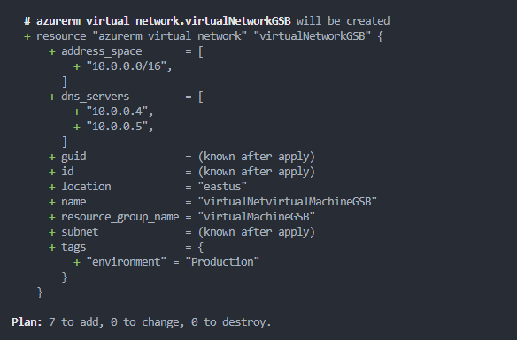
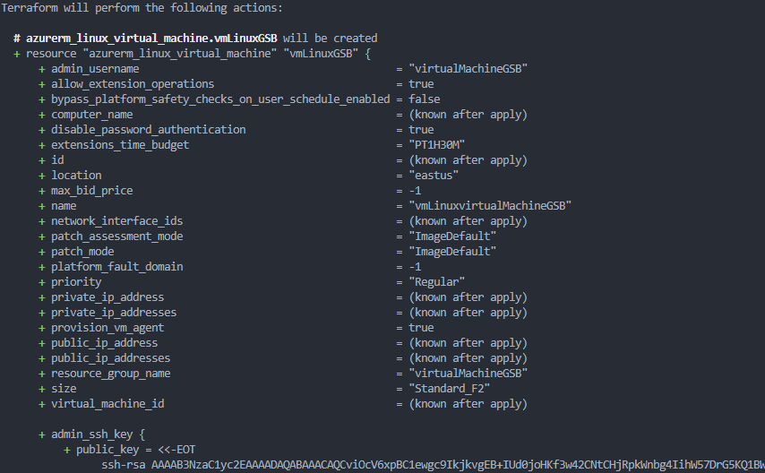
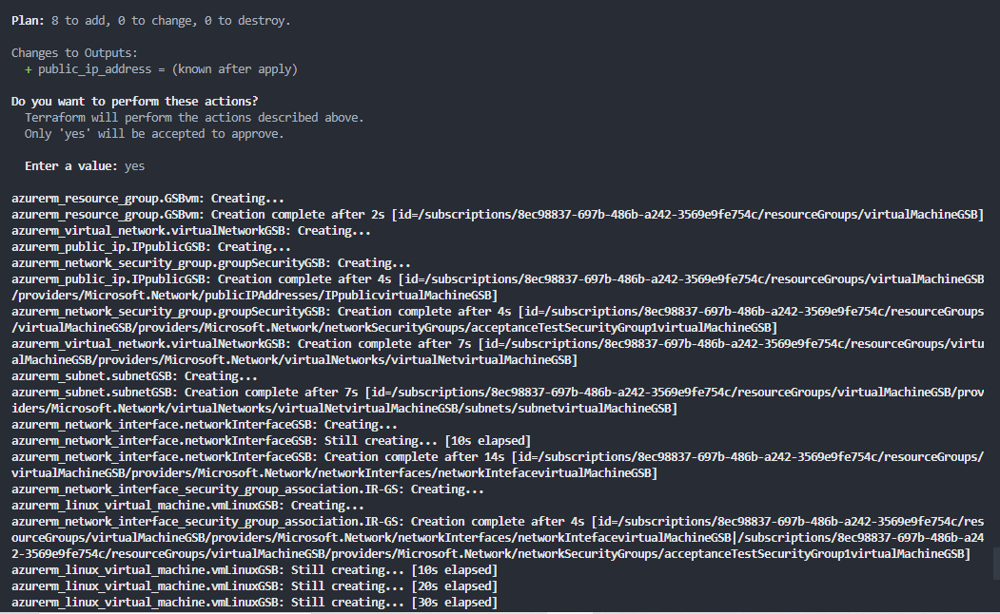
- terraform apply (Aplica los cambios del codigo de terraform, crea las instancias)
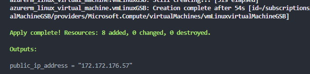
- terraform destroy (En caso de querer borrar todo el grupo de recursos)

## Evidencia
Ahora vamos a ver nuestra Azure Portal para ver si la maquina se creo correctamente
- Empezaremos mirando el grupo de recursos
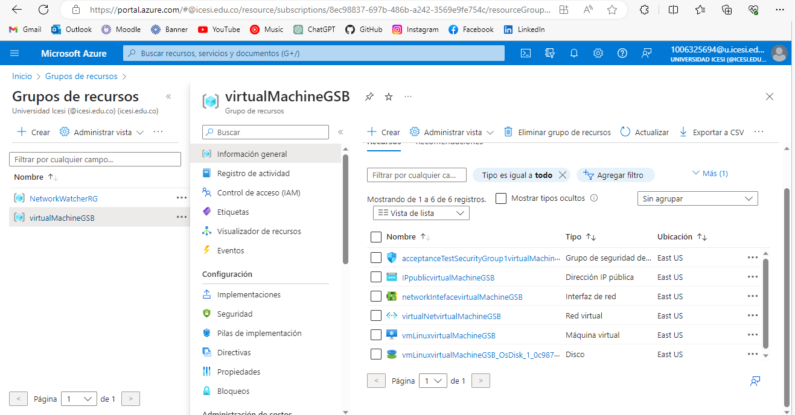
- Continuaremos con los detalles de la maquina.
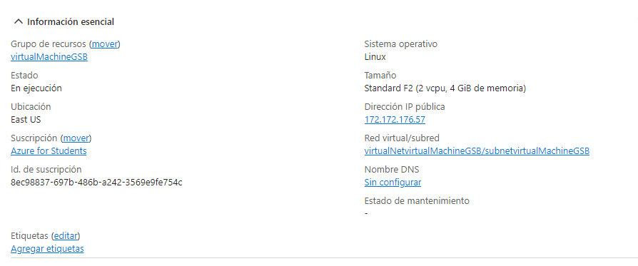

Ahora finalmente tenemos nuestra maquina montada en Azure


